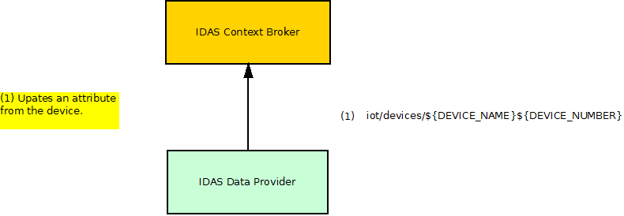

# IDAS: test cases description #

The IDAS component is an implementation of the Backend Device Management GE. 
Its main usage is to translate the Device or Gateway specific communication protocol into NGSI. It will always handle sensor notifications from the device towards the ContextBroker and for some specific protocols actuation/command messages from the ContextBroker to the device.

It has been only contemplated its most important service that is the one that sends data from the device to the agent. We have chosen updating the value of an attribute from the device.

## Test Cases 1.- Stress scenario ##

The goal of this scenario is to assess system performance with a high load.

In the involved dataflow, as depicted by the picture above, are expected 2 main actors which are played respectively by the hosts shown in the following table:

| Actor | SW Involved | VM Host | Role |
|-------|:------------|:--------|:-----|
| IDAS Data provider | JMeter script | Tester machine | Injects load to the component |
| IDAS component | IDAS | Physical machine | Subject of the test |

There's just one request in this script. This request updates an attribute from the device. The script adds 2 threads every three seconds until reaching 200. The duration of the test is 40 minutes

|ID	| GE API method	| Operation	| Type	| Payload	| Max. Concurrent Threads |
|---|:--------------|:----------|:------|:----------|:------------------------|
| 1 |	iot/devices/\${DEVICE_NAME}${DEVICE_NUMBER} | Device Update | PUT |   | 200 |

Regarding the variables

- **DEVICE_NAME**: It's the name of the used device.
- **DEVICE_NUMBER**: It's a counter that goes from 0000 to 0049
- **STATIC_ATTRIBUTE_NAME**: In this case we use the value 'test_static'.
- **MODIFIED_VALUE**: In this case we use the value 'modified_value'.

## Test Cases 2.- Stability Scenario ##

It's the same scenario that we have explained in the first case but with some different conditions. In this case we have used less threads(100) and it lasts 4 hours.