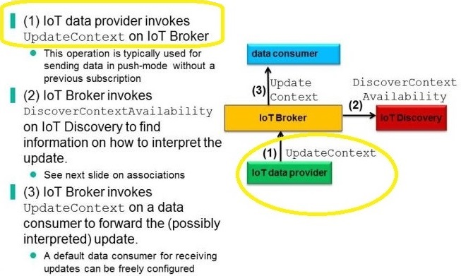
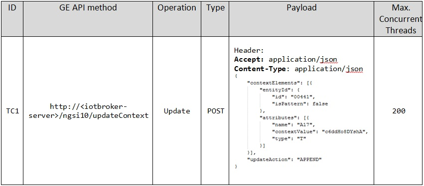
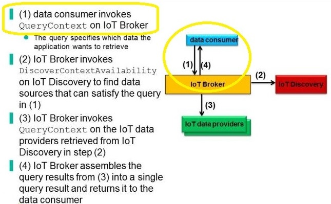
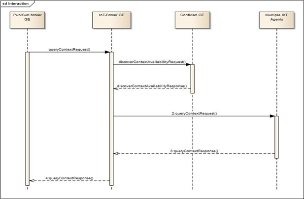
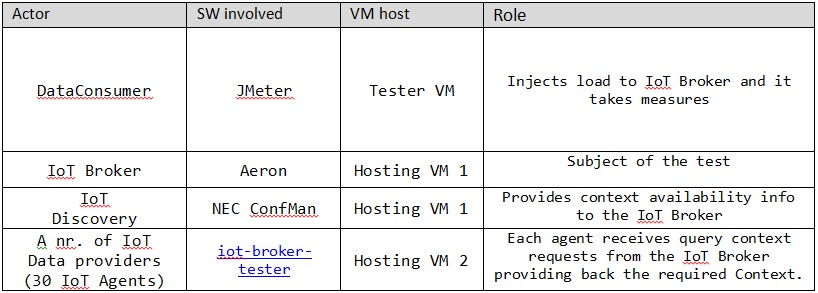
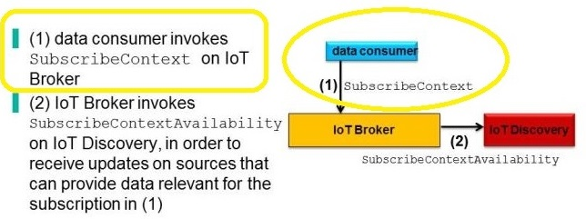
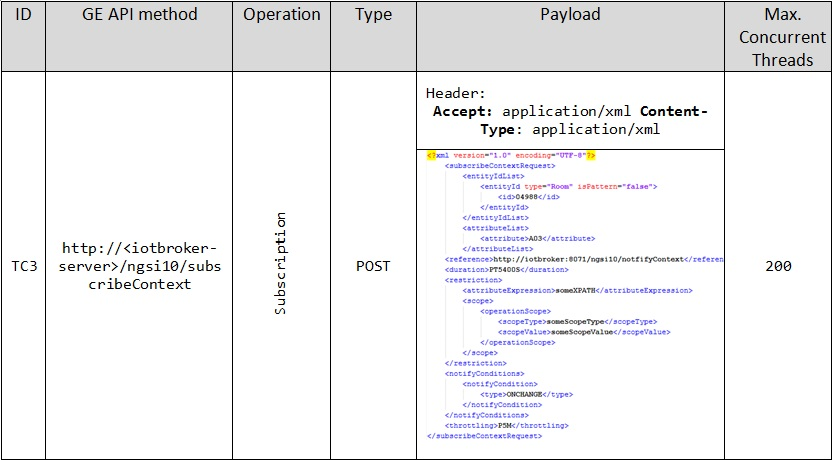

This project is part of [FIWARE](https://www.fiware.org/).

# IoT Broker: test cases description #
The scenarios defined for stress testing are taken from the most used operations of IoT Broker GEri which correspond to the following API methods:
 
- `updateContext`
- `queryContext` 
- `subscriptionContext`.

## Update context performance test case ##

This test aims to stress the NGSI-10 `updateContext` operation that represents the push-mode interaction offered by this GE. This means that no previously subscriptions are needed by the proper data flow as depicted by the picture below where the same dataflow is summarised. In yellow is circled the starting interaction solicited by the client tester VM (JMeter) towards the IoT Broker. 

In the involved dataflow, as depicted by the picture above, are expected 4 main actors which are played respectively by the hosts shown in the following table:

For this stress test 200 users are simulated by as many JMeter threads which solicite with a high number of requests (which depend on the capacity of the solicted component) the API `updateContext` during a period of 40’. 

The payload example in the table above is related to a typical message created by the JMeter test plan. 

## Query context stability test case ##

This test aims to assess stability, over the time and under a not too demanding workload, of the NGSI-10 `queryContext` operation that represents the interaction offered by this GE designed for the synchronous retrieval of data. The related dataflow taken into account is depicted and briefly described by the following picture. In this picture can be noted, circled in yellow, the starting interaction that is established by the testing system (JMeter) towards the IoT Broker.

The same Query data flow is also depicted more precisely by the following sequence diagram that is perfectly consistent with the previous block diagram.

 

It is therefore clear that this scenario is played by four main actors as summarised in the following table:

The test plan consists of the submission of a very light workload (5 users simulated by as many JMeter threads that uninterruptedly issue requests) to the IoTBroker for a period of 5 hours in a row.

## Subscribe context performance test case ##

This test aims to stress the NGSI-10 `subscribeContext` operation that represents the asynchronous data retrieval interaction offered by this GE.
The entire complex subscription scenario consists of three parts of which, in the following picture, is depicted the first one, namely that one considered for this test case; in this way, no further actors are needed besides the essential required to get back the acknowledge (subscriptionId) -from Aeron IoTBroker- expected by this scenario.
In the following picture the interaction directly involved by the test case is highlighted in yellow. 

In this data flow are thus expected 3 main actors which are played respectively by the hosts shown in the following table:

For this stress test, as well as for the first one (UpdateContext), 200 users are simulated by as many JMeter threads which solicite with a high number of requests (which depend on the capacity of the solicted component) the API `subscribeContext` during a period of 40’.
The main objective of this test case is to find the threshold where performances start to degrade.

The payload example in the table above is related to a typical message created by the JMeter test plan.The values of tags `<attribute>` and `<id>` are generated randomly.