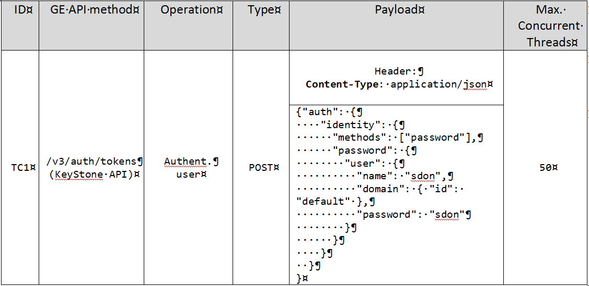

# Keyrock: test cases description #

The scenarios defined for stress testing are taken from the most used operations of Keyrock GEri which correspond to the following API methods:

- `User authentication`
- `Check roles assignment`
- `Get projects assignment`

In order to better explain test scenarios the general structure of a FIWARE IdM GE is sketched in the following figure:

## User authentication test case ##

This test aims to stress the authentication operation to obtain a valid token. A valid couple of user and password (already configured in Keyrock) is needed to complete the authentication operation.

Taking in consideration the general structure of a FIWARE IdM GE, the involved main actors are the following:  

- `User`
- `IdM GE - Authentication & Authorization`

The `User` is represented by **JMeter** application installed on a server and configured to send the authentication request to IdM GEri (see example table below).

The `IdM GE - Authentication & Authorization` is the **Keyrock** module able to cover the requested features and configured with at least one user.

Following a short description list about main steps of test case:

1. JMeter sends a user authentication request
2. Keyrock verifies input data and sends a positive (http code 200) or negative reply (http code 401) to JMeter. In positive case, Keyrock http response contains also a valid token in the header 

For this test JMeter has to be configured with 50 threads configured to stress Keyrock GEri for 30 minutes using the authentication API.

Here below a payload example related to a typical message created by the JMeter test plan.

##Check roles assignment test case	##

This test aims to stress the check roles assignment operation. A valid token obtained throught user authentication API is needed to complete the check rule operation.

Taking in consideration the general structure of a FIWARE IdM GE, the involved main actors are the following:  

- `User`
- `IdM GE - Authentication & Authorization`

The `User` is represented by **JMeter** application installed on a server and configured to send the check user role request to IdM GEri (see example table below).

The `IdM GE - Authentication & Authorization` is the **Keyrock** module able to cover the requested features and configured with at least one user (the one used to obtain a valid token).

Following a short description list about main steps of test case:

1. JMeter sends a check user role request
2. Keyrock verifies input data and sends a positive (http code 200) or negative reply (http code 401) to JMeter

For this test JMeter has to be configured with 50 threads configured to stress Keyrock GEri for 30 minutes using the authentication API.

Here below a payload example related to a typical message created by the JMeter test plan.

##Get projects assignment test case##

This test aims to stress the get project operation. A valid token obtained throught user authentication API is needed to complete the check rule operation.

Taking in consideration the general structure of a FIWARE IdM GE, the involved main actors are the following:  

- `User`
- `IdM GE - Authentication & Authorization`

The `User` is represented by **JMeter** application installed on a server and configured to send the get project request to IdM GEri (see example table below).

The `IdM GE - Authentication & Authorization` is the **Keyrock** module able to cover the requested features and configured with at least one user (the one used to obtain a valid token).

Following a short description list about main steps of test case:

1. JMeter sends a check user role request
2. Keyrock verifies input data and sends a positive (http code 200) or negative reply (http code 401) to JMeter

For this test JMeter has to be configured with 50 threads configured to stress Keyrock GEri for 30 minutes using the authentication API.

Here below a payload example related to a typical message created by the JMeter test plan.

##Check roles assignment test case	- stability test##

This test aims to stress the check roles assignment operation. A valid token obtained throught user authentication API is needed to complete the check rule operation.

Taking in consideration the general structure of a FIWARE IdM GE, the involved main actors are the following:  

- `User`
- `IdM GE - Authentication & Authorization`

The `User` is represented by **JMeter** application installed on a server and configured to send the check user role request to IdM GEri (see example table below).

The `IdM GE - Authentication & Authorization` is the **Keyrock** module able to cover the requested features and configured with at least one user (the one used to obtain a valid token).

Following a short description list about main steps of test case:

1. JMeter sends a check user role request
2. Keyrock verifies input data and sends a positive (http code 200) or negative reply (http code 401) to JMeter

For this test JMeter has to be configured with 10 threads configured to stress Keyrock GEri for 8 hours using the authentication API.

Here below a payload example related to a typical message created by the JMeter test plan.
